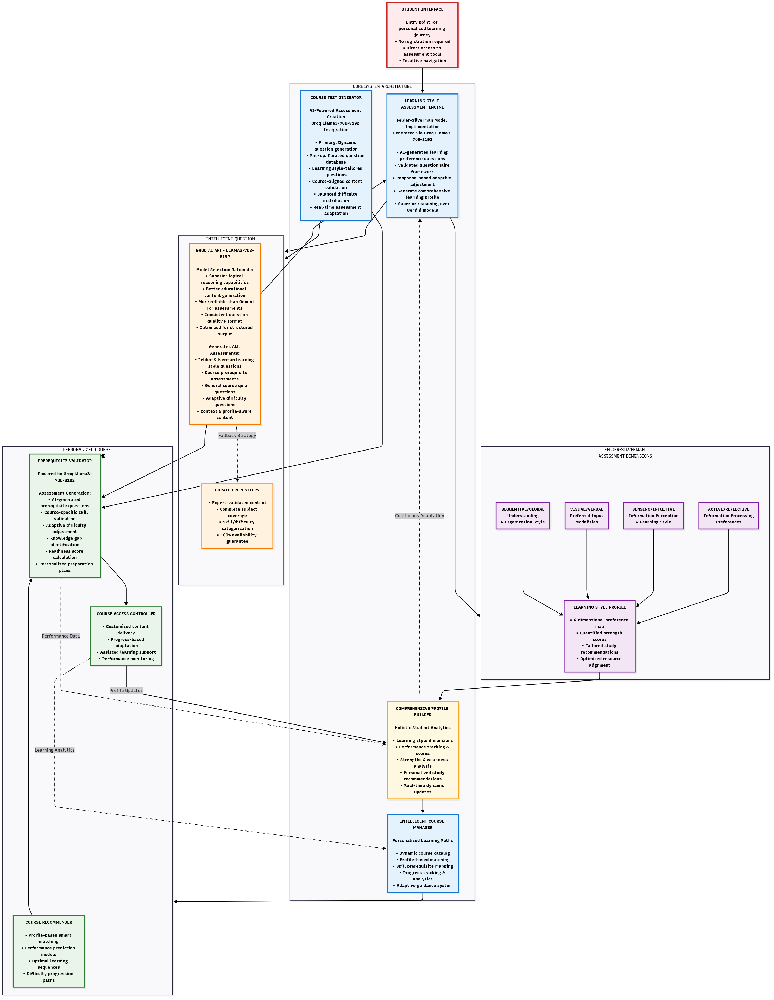

# Learning Style Profiling Agent

## Executive Summary

The Learning Style Profiling Agent is an advanced educational technology platform that leverages artificial intelligence to deliver personalized learning experiences. Built on the scientifically validated Felder-Silverman Learning Style Model, the system employs Groq's Llama3-70B-8192 language model to generate adaptive assessments and provide comprehensive learner profiling. This solution addresses the critical need for individualized education by creating data-driven learning pathways that optimize student engagement and academic outcomes.

## System Overview

The platform operates as a comprehensive educational assessment and personalization engine, designed to evaluate individual learning preferences and subject-matter competencies. Through sophisticated AI-powered evaluation mechanisms, the system creates detailed learner profiles that inform personalized educational experiences across multiple academic domains.

### Core Functionality

The system integrates learning style assessment with competency-based evaluation to provide a holistic understanding of each learner's educational profile. This dual-assessment approach ensures that educational content is not only aligned with individual learning preferences but also appropriately calibrated to the learner's current knowledge level.

## System Architecture

The diagram below shows the architecture of the Learning Style Profiling Agent, detailing its core components and their interactions.

## Pedagogical Framework

### Felder-Silverman Learning Style Model Implementation

The platform implements a comprehensive assessment of the four primary learning dimensions established by Felder and Silverman:

**Processing Dimension: Active versus Reflective Learning**
Active learners demonstrate optimal performance through experiential learning, collaborative activities, and practical application of concepts. Reflective learners achieve superior results through contemplative analysis, individual study, and theoretical exploration before practical application.

**Perception Dimension: Sensing versus Intuitive Learning**
Sensing learners excel when presented with concrete information, empirical data, and systematic procedural approaches. Intuitive learners perform optimally with abstract concepts, theoretical frameworks, and innovative problem-solving methodologies.

**Input Dimension: Visual versus Verbal Learning**
Visual learners demonstrate enhanced comprehension through graphical representations, diagrams, and multimedia content. Verbal learners achieve superior results through textual materials, auditory instruction, and discussion-based learning environments.

**Understanding Dimension: Sequential versus Global Learning**
Sequential learners build knowledge through structured, linear progression of concepts and logical step-by-step processes. Global learners require comprehensive contextual understanding before engaging with specific details and components.

## Student Engagement Process

### Initial Assessment Phase

Upon platform entry, students undergo a comprehensive learning style evaluation consisting of AI-generated questions specifically designed to assess preferences across all four Felder-Silverman dimensions. 
In the event of an API failure, a set of pre-stored fallback questions is automatically displayed to ensure uninterrupted assessment.

### Results Analysis and Reporting

Following assessment completion, students receive detailed analytical reports that include quantified dimensional preferences, comprehensive learning style explanations, and evidence-based study recommendations. These reports serve as foundational documents for subsequent educational planning and course selection.

### Course Access and Competency Evaluation

Students gain access to the course catalog after completing their learning style assessment. However, enrollment in specific courses requires successful completion of prerequisite competency assessments. These evaluations measure subject-specific knowledge, identify learning gaps, and determine appropriate instructional difficulty levels.

### Personalized Learning Environment
Upon successful competency demonstration, students will access course materials specifically adapted to their identified learning preferences. Content presentation, instructional methodologies, and assessment formats align with individual learning style profiles to optimize educational effectiveness.
This personalized delivery will be activated following the integration with the content recommendation agent, which will tailor learning paths based on both style profiling and topic-specific performance.

## Technical Architecture

### AI-Powered Assessment Generation

The system utilizes Groq's Llama3-70B-8192 model for dynamic assessment creation, selected for its superior performance and efficiency in educational content generation compared to alternative language models such as GEMINI. Key technical advantages include:

- Enhanced logical reasoning capabilities for educationally valid question construction
- Consistent API response quality for assessment reliability
- Superior contextual understanding for adaptive questioning sequences

### Dual Assessment Framework

The platform employs two distinct assessment methodologies:

**Learning Style Assessment**: Generates Felder-Silverman-compliant questions that adapt dynamically to student responses, ensuring comprehensive evaluation across all learning dimensions while minimizing assessment duration.

**Competency-Based Assessment**: Creates subject-specific evaluations that measure prerequisite knowledge, identify skill gaps, and establish appropriate instructional entry points for individual learners.

## Data Management and Analytics

### Comprehensive Learner Profiles

The system maintains detailed profiles encompassing both learning style preferences and academic competencies. These profiles include dimensional scoring across Felder-Silverman categories, personalized study strategies, resource recommendations, and optimal learning environment specifications.

### Performance Tracking and Analytics

Continuous monitoring of student progress is handled by the Progress Tracking Agent, which evaluates assessment performance metrics, course completion rates, competency development, and dynamically refines personalized recommendations based on ongoing learning outcomes.

### Adaptive Profile Evolution

Learner profiles undergo continuous refinement as students complete additional assessments and coursework. This iterative improvement process ensures increasingly accurate personalization and educational effectiveness over time.

## Educational Impact and Benefits

### Student Outcomes

The platform provides students with enhanced self-awareness regarding learning preferences, optimized study methodologies aligned with individual learning styles, appropriate academic challenges based on demonstrated competencies, and transparent progress tracking across multiple academic domains.

### Institutional Benefits

Educational institutions benefit from scalable personalization capabilities, comprehensive learning analytics, optimized resource allocation based on student needs, and improved predictive modeling for student success outcomes.

### Educator Support

The system provides educators with detailed student learning profiles, data-driven instructional adaptation capabilities, accurate prerequisite knowledge assessment, and evidence-based approaches to individualized student support.

## Future Development

Planned enhancements include expanded assessment capabilities across additional learning style models, integration of advanced learning analytics for predictive modeling, enhanced adaptive content delivery mechanisms, and broadened subject-matter coverage across academic disciplines.

---

**Advanced Educational Technology for Personalized Learning Excellence**

## Demo

